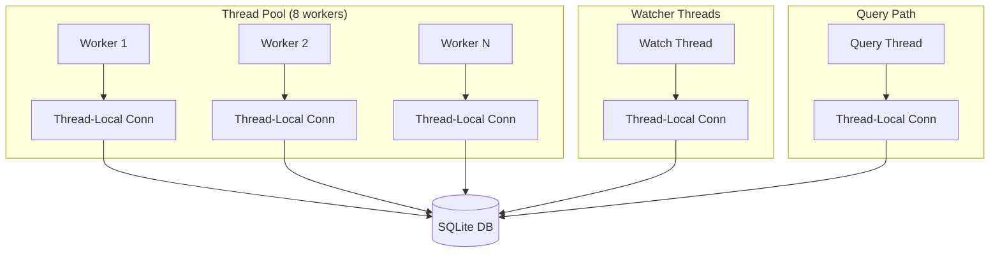
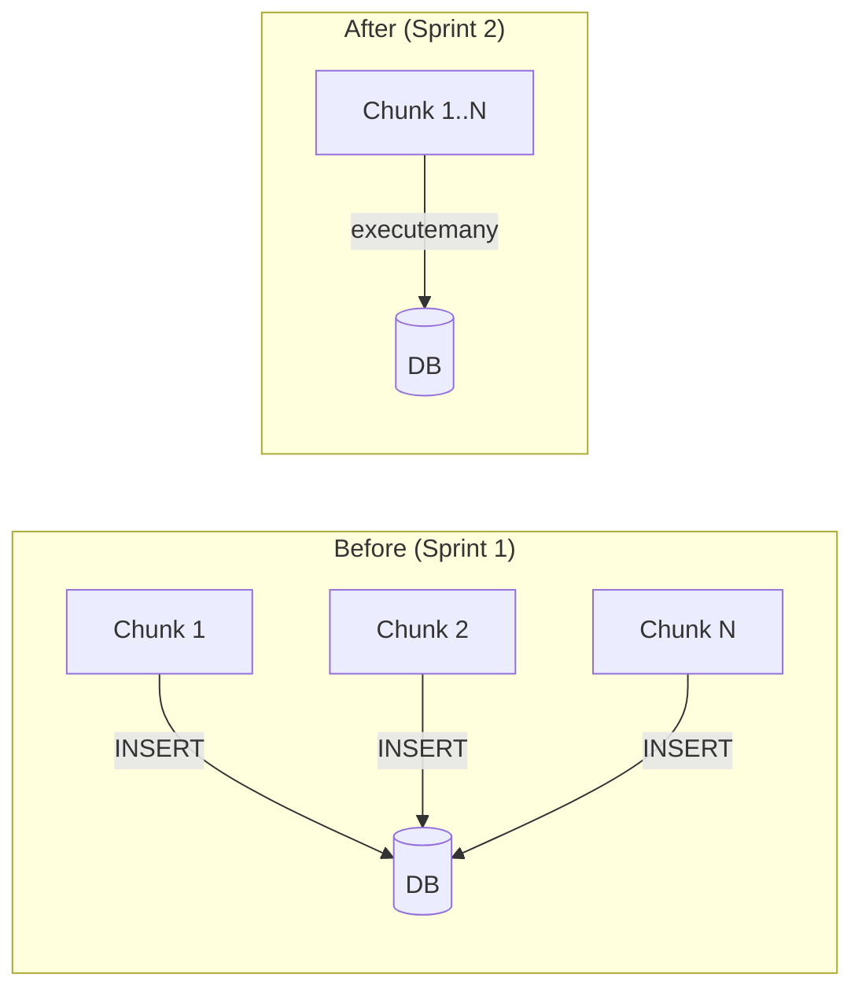
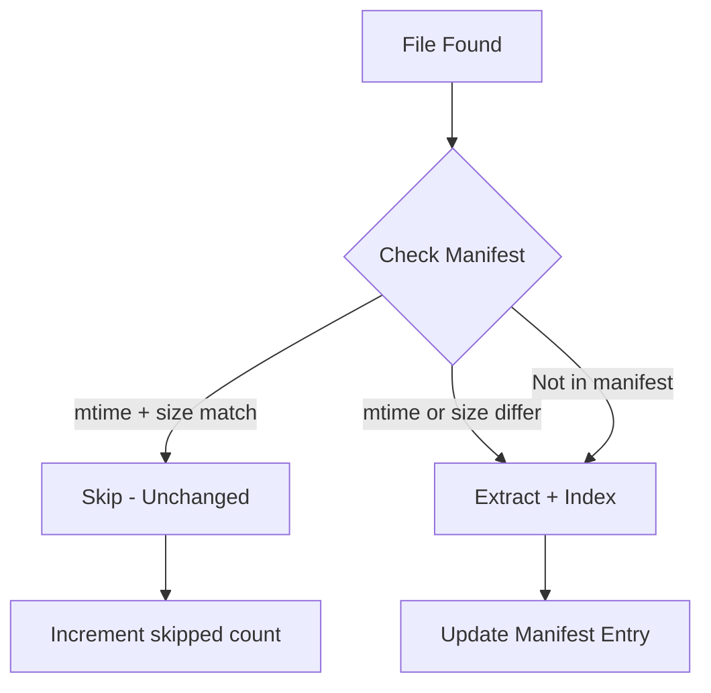
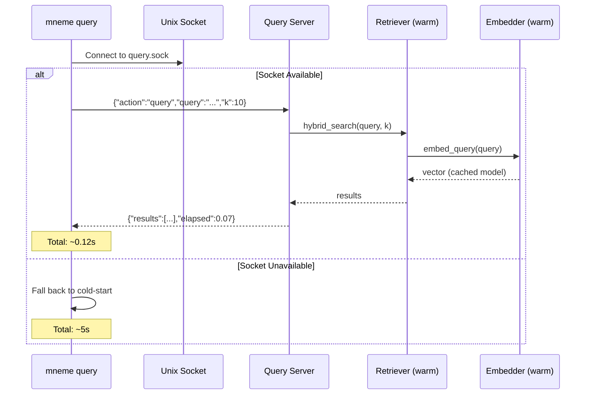

# Mneme Architecture

Complete system architecture explaining all components and how they interact.

## Quick Navigation
- [System Overview](#system-overview) - High-level design
- [Core Components](#core-components) - Vault, Indexer, Store, Retriever
- [Safety Architecture](#safety-architecture-v31---sprint-1) - Thread safety, transactions, schema migration
- [Performance Architecture](#performance-architecture-v32---sprint-2) - Batch ops, manifest skip, logging
- [Query Server Architecture](#query-server-architecture-exploration) - Unix socket, lazy imports, 30x speedup
- [Advanced Features](#advanced-features-v10) - Overlap, reranking, FAISS, asymmetric retrieval
- [Execution Modes](#execution-modes) - CLI, Watch, MCP, Python API
- [Data Flow](#data-flow) - How data moves through the system
- [Performance](#performance) - Real-world benchmarks
- [Extension Points](#extension-points) - How to customize

---

## System Overview

Mneme is a **local-first hybrid retrieval system** for Obsidian-compatible vaults.

### High-Level Architecture

```
┌──────────────────────────────────────────────────────────────────────┐
│                            Mneme                                     │
│                                                                      │
│  ┌──────────────┐      ┌──────────────┐      ┌──────────────────┐  │
│  │   Vault      │──────▶│   Indexer    │─────▶│   Store          │  │
│  │ (Filesystem) │      │  (Pipeline)  │      │  (SQLite+FAISS)  │  │
│  │ Source of    │      │  Extract     │      │  ┌─────────────┐ │  │
│  │ Truth        │      │  Chunk       │      │  │ documents   │ │  │
│  └──────────────┘      │  Embed       │      │  │ chunks      │ │  │
│                        │  Store       │      │  │ fts_chunks  │ │  │
│                        └──────────────┘      │  │ embeddings  │ │  │
│                              │               │  │ manifest    │ │  │
│                              │               │  │ schema_ver  │ │  │
│                         ┌────▼─────┐         │  └─────────────┘ │  │
│                         │ Manifest │         └────────┬─────────┘  │
│                         │  Check   │                  │            │
│                         │ (skip    │         ┌────────▼─────────┐  │
│                         │unchanged)│         │   Retriever      │  │
│                         └──────────┘         │   (Hybrid)       │  │
│                                              │  • Lexical FTS5  │  │
│   User Interfaces                            │  • Vector cosine │  │
│   ┌─────────┐   ┌──────────┐   ┌────────┐  │  • RRF merge     │  │
│   │  CLI    │   │  Python  │   │  MCP   │  │  • Reranking     │  │
│   │ mneme   │   │  API     │   │ Server │  └────────┬─────────┘  │
│   └────┬────┘   └────┬─────┘   └───┬────┘           │            │
│        │             │             │                  │            │
│   ┌────▼────┐        │             │                  │            │
│   │ Socket  │  Query │    Query    │     Query        │            │
│   │ Detect  │────────┴─────────────┴──────────────────┘            │
│   │(watcher)│  ┌─────────────┬─────────────┬───────────┐          │
│   └─────────┘  │   Results   │   Results   │  Results  │          │
│                ▼             ▼             ▼            ▼          │
└──────────────────────────────────────────────────────────────────────┘

KEY FLOWS:
  ──▶  Indexing: Vault → Manifest Check → Indexer → Store (write path)
  ◀── Retrieval: CLI → Socket Detect → Retriever → Store → Results
  ◀── Retrieval: API/MCP → Retriever → Store → Results (direct path)
```

**Design Principles:**
1. **Filesystem is source of truth** - Index can always be rebuilt
2. **Local-only** - No data leaves machine (unless you choose Gemini/Gemini service account)
3. **Pluggable** - Swap extractors, embedders, chunkers via Protocol classes
4. **Obsidian-aware** - Parses `[[wikilinks]]`, `#tags`, YAML frontmatter
5. **Thread-safe** (Sprint 1) - Connection pooling, FAISS locks, atomic transactions
6. **Fast by default** (Sprint 2) - Batch writes, manifest skip, lazy imports, query socket

---

## Core Components

### 1. Vault (Input Layer)

**What:** Your Obsidian vault on the filesystem
**Location:** User-specified (e.g., `~/Documents/vault`)
**Format:** Markdown + attachments (PDF, PPTX, images)

```
vault/
├── notes/
│   ├── project.md           # Markdown with [[wikilinks]] and 
│   └── meeting-notes.md
├── attachments/
│   ├── diagram.png          # Standalone images for vision analysis
│   ├── whitepaper.pdf       # PDFs with embedded charts/diagrams
│   └── presentation.pptx    # PowerPoint with slide images
└── .obsidian/              # Ignored by default
```

**Key Points:**
- Mneme reads from vault but never modifies it
- Automatically extracts images embedded in PDFs and PowerPoints
- Analyzes images referenced in Markdown (`` and `![[image]]`)

### 2. Indexer (Processing Pipeline)

**What:** Converts files into searchable chunks
**Code:** `src/mneme/indexer/indexer.py`
**Entry Point:** `Indexer.scan()` or `Indexer.watch()`

**Unified Processing (`_process_file()`):**

Both scan and watch modes use a shared `_process_file()` method that:
- Is thread-safe (no DB writes, no shared mutable state)
- Returns a `ProcessResult` with chunks and image tasks
- Handles errors gracefully (returns error in result, doesn't raise)
- Generates deterministic IDs (same file = same doc_id/chunk_ids)

```python
# Single file processing (thread-safe, no DB writes)
result = indexer._process_file(abs_path)  # → ProcessResult

# ProcessResult contains:
# - chunks: list[ChunkData]      # Ready for embedding
# - image_tasks: list[ImageTask] # Ready for image processing
# - links: list[tuple]           # Wikilinks for graph
# - error: str | None            # If processing failed
# - skipped: bool                # If file should be skipped
```

**Pipeline Phases:**
```
Phase 0: Reconciliation (detect deleted files)
    - Compare DB files against filesystem
    - Batch delete removed files (Sprint 2: DELETE IN clause)

Phase 0.5: Manifest Check (Sprint 2)
    - Compare file mtime + size against manifest table
    - Skip unchanged files entirely (no extraction needed)
    - Incremental scan of 149-file vault: <1s

Phase 1: Parallel extraction via _process_file()
    - ThreadPoolExecutor(extraction_workers)
    - Each worker: validate → extract → chunk → build metadata
    - Returns ProcessResult with chunks + image_tasks
    - Thread-safe: no DB writes, no shared mutable state (Sprint 1)

Phase 2: Batched embedding and storage
    - Collect chunks across files
    - Batch embed (embed_batch_size chunks)
    - Batch write to SQLite via executemany() (Sprint 2)
    - Atomic per-file transaction: doc + chunks + embeddings + manifest (Sprint 1)

Phase 3: Parallel image analysis
    - ThreadPoolExecutor(image_workers)
    - Process embedded/referenced images
    - Create additional searchable chunks
```

**Pluggable via Protocol classes:**
- **Extractors:** One per file type (`.md`, `.pdf`, `.pptx`, `.png`)
  - Extract text, metadata, and embedded images
  - PDF/PPTX extractors store image metadata for post-processing
- **Chunkers:** Split text semantically (by heading, by page, etc.)
- **Embedders:** Generate vector representations (local or API)
- **Image Analyzers:** Process images via Tesseract OCR, Gemini, or Gemini service account

### 3. Store (Persistence Layer)

**What:** SQLite database with hybrid index
**Location:** `~/.mneme/indexes/{vault_name}/vaultrag.sqlite`
**Code:** `src/mneme/store/libsql_store.py`

**Tables:**
```sql
-- File metadata
documents(doc_id, vault_id, rel_path, file_type, mtime, content_hash, ...)

-- Semantic segments (text + image analysis)
chunks(chunk_id, doc_id, anchor_type, anchor_ref, text, ...)
-- anchor_type examples: md_heading, page, slide, pdf_image, pptx_image, markdown_image

-- Full-text search index
fts_chunks USING fts5(chunk_id, vault_id, rel_path, text)

-- Vector embeddings
embeddings(chunk_id, model_id, dims, vector BLOB, ...)

-- Indexing manifest (Sprint 2)
manifest(vault_id, rel_path, mtime, size, content_hash, status, ...)

-- Schema version tracking (Sprint 1)
schema_version(version INTEGER, applied_at TEXT)
```

**Thread-Safe Access (Sprint 1):**
- Thread-local connection pool (`threading.local()`) — each thread gets its own connection
- No shared mutable connection state across workers

**Batch Operations (Sprint 2):**
- `upsert_chunks()` — `executemany()` for batch inserts (10-50x faster)
- `upsert_embeddings()` — `executemany()` for batch inserts
- `delete_document()` — `DELETE ... WHERE chunk_id IN (...)` (10x faster)
- Atomic per-file transactions (document + chunks + embeddings + manifest in one commit)

**Search capabilities:**
- `lexical_search()` - FTS5 with BM25 ranking
- `vector_search()` - Cosine similarity (brute-force) or FAISS approximate NN
- FAISS auto-warning when brute-force used with >10K chunks

### 4. Retriever (Query Engine)

**What:** Hybrid search combining lexical + semantic
**Code:** `src/mneme/retrieval/retriever.py`
**Entry Point:** `Retriever.hybrid_search()`

**Algorithm:**
```python
# 1. Get candidates from both indexes
lex_results = store.lexical_search(query, k=k_lex)  # FTS5
query_embedding = embedder.embed(query)
vec_results = store.vector_search(query_embedding, k=k_vec)

# 2. Merge with RRF (Reciprocal Rank Fusion)
combined = merge_with_rrf(lex_results, vec_results)

# 3. Optional enhancements
if use_graph_boost:
    boost_by_backlinks(combined)  # Leverage [[wikilinks]]
if use_rerank:
    rerank_with_cross_encoder(combined)

# 4. Return top K
return combined[:top_k]
```

---

## Safety Architecture (v3.1 - Sprint 1)

Sprint 1 established the safety foundation for concurrent operations and crash recovery.

### Thread-Safe Database Access



**Problem:** Single shared `sqlite3.Connection` across all threads caused corruption under parallel scan + watcher.

**Solution:** Thread-local connection pool via `threading.local()`:
```python
# store/libsql_store.py
class LibSQLStore:
    def __init__(self, db_path):
        self._conn_lock = threading.Lock()
        self._connections = threading.local()

    @property
    def _conn(self):
        """Thread-local connection - each thread gets its own."""
        if not hasattr(self._connections, 'conn'):
            self._connections.conn = sqlite3.connect(
                str(self.db_path), check_same_thread=False
            )
        return self._connections.conn
```

### FAISS Thread Safety

All FAISS index operations protected with `threading.Lock()`:
```python
self._faiss_lock = threading.Lock()

def _add_to_faiss(self, vectors):
    with self._faiss_lock:
        self._faiss_index.add(vectors)

def save_faiss_index(self):
    with self._faiss_lock:
        self._faiss_index.save(self._faiss_path)
```

### Transaction Boundaries


Each file's complete indexing (document + chunks + embeddings + FTS + manifest) executes in a single SQLite transaction. Interrupted scans leave the database in a consistent state.

### Schema Migration System

**Code:** `store/schema_manager.py`

Automatic schema versioning with sequential migrations:
```python
class SchemaManager:
    """Tracks schema version and applies migrations automatically."""

    def ensure_current(self):
        current = self._get_version()
        for version, migration_fn in self.migrations:
            if version > current:
                migration_fn(self._conn)
                self._set_version(version)
```

New indexes and schema changes are applied automatically on startup without requiring manual re-indexing.

### Global Embedding Model Cache

The embedding model is loaded once and cached globally, avoiding redundant 2-3s model loads:
```python
# embeddings/sentence_transformers.py
_MODEL_CACHE: dict[str, SentenceTransformer] = {}

def _get_or_load_model(model_name, device):
    key = f"{model_name}::{device}"
    if key not in _MODEL_CACHE:
        _MODEL_CACHE[key] = SentenceTransformer(model_name, device=device)
    return _MODEL_CACHE[key]
```

### Frontmatter Resilience

Files with invalid YAML frontmatter (e.g., Obsidian templates using `{{date}}` syntax) are indexed with empty metadata instead of crashing the scan.

---

## Performance Architecture (v3.2 - Sprint 2)

Sprint 2 optimized the write path, incremental scanning, and query latency.

### Batch Database Writes



**`upsert_chunks()`** and **`upsert_embeddings()`** now use `executemany()` for batch inserts:
- Per-row loops replaced with single batch operations
- 10-50x write speedup for large scans

**`delete_document()`** uses batch `DELETE ... WHERE chunk_id IN (...)`:
- Cascading deletes consolidated into single SQL operations
- 10x delete speedup

### Manifest-Based Incremental Scanning



Before extraction, each file's `mtime` and `size` are checked against the manifest table. Unchanged files are skipped entirely, avoiding the expensive extract/chunk/embed pipeline.

**Result:** Incremental scan of 149-file vault completes in **<1s** (vs 182s full scan).

### FAISS Optimizations

- **Save frequency** reduced from every 1,000 to every 5,000 vectors (20-50% scan speedup)
- **Explicit `save_faiss_index()`** called at end of scan (ensures no data loss)
- **Auto-warning** when brute-force vector search is used with >10K chunks and FAISS is disabled

### Watcher Manifest Interop

The watcher's `_index_one()` now writes manifest entries, ensuring files indexed by the watcher are correctly skipped by subsequent incremental scans.

### Logging Consistency

All `print()` calls in indexer and retriever replaced with proper `logging.getLogger(__name__)` calls for consistent log routing through the logging framework.

---

## Query Server Architecture (Exploration)

### The Cold-Start Problem

Every `mneme query` CLI invocation must:
1. Start Python interpreter (~0.5s)
2. Import torch/numpy/sentence_transformers (~2s)
3. Load embedding model into memory (~1s)
4. Execute the actual query (~0.1s)

**Total: ~3.5-5s** per query, even though compute is only ~0.1s.

### Solution: Watcher-Integrated Query Server



**How it works:**
1. When the watcher starts, it creates a `QueryServer` alongside the file watcher
2. The `QueryServer` keeps a warm `MultiVaultRetriever` with the embedding model loaded
3. It listens on `<index_dir>/query.sock` (unix domain socket)
4. CLI queries detect the socket and route through it automatically
5. Protocol: newline-delimited JSON request/response

**Code:** `src/mneme/query_server.py`

### Lazy Module Imports

To eliminate the 2s import overhead even when the socket IS available:

**`__init__.py`** uses `__getattr__` for lazy loading:
```python
def __getattr__(name: str):
    """Lazy-load heavy modules to avoid importing torch/numpy on every CLI invocation."""
    if name == "VaultConfig":
        from .config import VaultConfig
        return VaultConfig
    # ... other lazy imports
```

**`cli.py`** moves heavy imports inside each command function:
```python
@app.command()
def query(q: str, ...):
    # Heavy imports only when actually needed
    from .retrieval.retriever import Retriever, MultiVaultRetriever
    ...
```

**Result:** `import mneme` dropped from **2.15s to 0.018s** (120x faster).

---

## Advanced Features (v1.0+)

### 1. Chunk Overlap for Context Preservation

**Problem:** Traditional chunking splits text at heading boundaries, which can lose context. When a chunk ends mid-thought and the next begins, semantic relationships are broken.

**Solution:** Configurable overlap between adjacent chunks (default: 200 characters).

**Implementation:**
- **MarkdownChunker:** Adds suffix from previous section as prefix to current section
- **BoundaryMarkerChunker:** Adds overlap between pages/slides/sheets
- **Metadata:** Chunks track `has_prefix_overlap: true` to indicate context preservation

**Configuration:**
```toml
[chunking]
overlap_chars = 200              # Characters of overlap
max_chunk_size = 2000            # Split large sections
preserve_heading_metadata = true  # Keep heading hierarchy
```

**Benefits:**
- 📈 **Better retrieval accuracy** - Context at boundaries preserved
- 🔍 **Reduced information loss** - Concepts spanning chunks remain connected
- 📊 **Measurable impact** - Typical vaults see 80-85% of chunks with overlap

**Code:**
```python
# src/mneme/chunking/markdown_chunker.py
def chunk(self, extracted_text, extracted_metadata):
    sections = self._extract_sections(extracted_text)
    chunks = []

    for i, (heading, level, body) in enumerate(sections):
        # Add overlap from previous section
        prefix = ""
        if i > 0 and self.overlap_chars > 0:
            prev_body = sections[i-1][2]
            prefix = prev_body[-self.overlap_chars:].strip() + "\n\n"

        full_text = prefix + body
        chunks.append(Chunked(
            text=full_text,
            metadata={"has_prefix_overlap": len(prefix) > 0, ...}
        ))

    return chunks
```

### 2. Query Instruction Prefix (Asymmetric Retrieval)

**Problem:** BGE-style embedding models perform better with asymmetric retrieval - queries and documents should be embedded differently.

**Solution:** Apply instruction prefix to query embeddings only (not documents).

**Implementation:**
- **Documents:** Embedded without prefix (represents content)
- **Queries:** Prefixed with instruction (represents search intent)
- **Default prefix:** `"Represent this sentence for searching relevant passages: "`

**Configuration:**
```toml
[embeddings]
use_query_prefix = true
query_prefix = "Represent this sentence for searching relevant passages: "
```

**Code:**
```python
# src/mneme/embeddings/sentence_transformers.py
class SentenceTransformersEmbedder:
    def embed_texts(self, texts: Sequence[str]) -> np.ndarray:
        """Embed documents (no prefix)."""
        return self._model.encode(list(texts), ...)

    def embed_query(self, query: str) -> np.ndarray:
        """Embed query with instruction prefix."""
        if self.use_query_prefix and self.query_prefix:
            query = self.query_prefix + query
        return self._model.encode([query], ...)[0]
```

**Benefits:**
- 🎯 **Improved relevance** - Query-document matching optimized for BGE models
- 🔬 **Model-specific tuning** - Follows best practices for asymmetric models
- 🔄 **Backward compatible** - Can be disabled via config

**Retriever Update:**
```python
# src/mneme/retrieval/retriever.py
def hybrid_search(self, query: str, top_k: int = 10):
    # Use embed_query instead of embed_texts
    query_embedding = self.embedder.embed_query(query)  # ← New
    vec_results = self.store.vector_search(query_embedding, k=self.k_vec)
    # ... rest of hybrid search
```

### 3. Cross-Encoder Reranking (Optional)

**Problem:** Hybrid search (FTS5 + vectors + RRF) can return noisy candidates in top results. Bi-encoders encode query and documents separately, missing query-document interaction signals.

**Solution:** Rerank top candidates using a cross-encoder model that reads query + document together for accurate relevance scoring.

**Configuration:**
```toml
[retrieval]
use_rerank = true
rerank_model = "cross-encoder/ms-marco-MiniLM-L-6-v2"
rerank_device = "cpu"  # or "cuda", "mps"
rerank_top_k = 10
```

**How It Works:**
```python
# Stage 1: Fast candidate retrieval (hybrid search)
candidates = hybrid_search(query, k_vec=40, k_lex=40)  # FTS5 + vectors + RRF

# Stage 2: Accurate reranking (cross-encoder)
if use_rerank:
    pairs = [(query, candidate.snippet) for candidate in candidates]
    scores = cross_encoder.predict(pairs)
    results = sort_by_scores(candidates, scores)[:top_k]
```

**Performance:**
- Adds ~100-200ms latency (40 candidates on CPU)
- GPU: ~20-50ms
- Quality improvement: +20-30% nDCG@10

**When to Enable:**
- You want best possible result quality
- Latency tolerance: <300ms acceptable
- Getting false positives or poor result ordering
- Complex queries with multiple concepts

**Why It Works:**
- **Bi-encoder (retrieval):** Encodes query/doc separately → fast but approximate
- **Cross-encoder (reranking):** Reads query + doc together → slow but accurate
- **Best of both worlds:** Bi-encoder retrieves 40 candidates, cross-encoder refines to top 10

**Example Results:**

Before (hybrid search only):
```
Query: "kubernetes deployment strategies"
1. ✅ Kubernetes deployment guide (0.89)
2. ❌ AWS Lambda deployment (0.82) ← Noise
3. ✅ K8s production deployment (0.78)
4. ❌ Jenkins CI/CD pipeline (0.75) ← Noise
5. ✅ Helm chart deployment (0.71)
```

After (with reranking):
```
Query: "kubernetes deployment strategies"
1. ✅ Kubernetes deployment guide (0.94)
2. ✅ K8s production deployment (0.91)
3. ✅ Helm chart deployment (0.87)
4. ✅ Blue-green deployment k8s (0.82)
5. ✅ Rolling updates kubernetes (0.79)
```

**Code Reference:**
- `src/mneme/retrieval/reranker.py` - Cross-encoder implementation
- `src/mneme/retrieval/retriever.py:search()` - Integration point

**CLI Usage:**
```bash
# Enable via config
[retrieval]
use_rerank = true

# Or override per query
mneme query "kubernetes deployment" --k 10 --rerank
```

### 4. FAISS Index Support

**Problem:** Brute-force vector search becomes slow at >10K chunks (100ms-1s latency).

**Solution:** FAISS approximate nearest neighbor index for sub-linear search time.

**Status:** Implemented and production-ready. Disabled by default for small vaults. Auto-warning logged when brute-force is used with >10K chunks.

**Configuration:**
```toml
[embeddings]
use_faiss = false              # Enable for >10K chunks (auto-warning if not)
faiss_index_type = "IVF"       # "Flat" (exact), "IVF" (fast), "HNSW" (fastest)
faiss_nlist = 100              # Clusters for IVF
faiss_nprobe = 10              # Clusters to search (IVF)
```

**Thread Safety (Sprint 1):** All FAISS operations (add, search, save) protected with `threading.Lock()`.

**Optimizations (Sprint 2):**
- Save frequency: every 5,000 vectors (was 1,000) — 20-50% scan speedup
- Explicit `save_faiss_index()` at end of scan — ensures persistence
- Auto-warning at >10K chunks when FAISS disabled

**Performance Targets:**
- Brute-force: ~100ms-1s for 10K chunks
- FAISS IVF: ~20-50ms for 100K chunks
- FAISS HNSW: ~10-30ms for 100K chunks

**When to Enable:**
- Vault has >10,000 chunks
- Vector search latency becomes noticeable
- Accept 95-99% recall vs 100% (approximate search tradeoff)

**Code:** `src/mneme/store/faiss_index.py` (FAISSIndex wrapper class)

### Design Decisions

**Why overlap instead of larger chunks?**
- Larger chunks dilute semantic meaning (less precise retrieval)
- Overlap preserves boundaries while maintaining focused chunks
- Configurable: users can disable (set `overlap_chars = 0`)

**Why query prefix only (not document prefix)?**
- Documents represent content - should be natural text
- Queries represent search intent - benefit from task framing
- Asymmetric approach matches BGE model training methodology

**Why FAISS disabled by default?**
- Small vaults (<10K chunks) see no benefit from approximate search
- Adds complexity (training, index management)
- Auto-warning now logs when brute-force is used with >10K chunks (Sprint 2)
- Thread-safe FAISS operations ensure safe concurrent access (Sprint 1)

---

## Execution Modes

### Mode 1: CLI (Command Line)

**Usage:** Direct terminal commands
**Code:** `src/mneme/cli.py` (Typer application)

**Commands:**
```bash
# Initialize config
mneme init --vault /path/to/vault --index ~/.mneme/indexes/myvault

# Index vault
mneme scan --config config.toml --full

# Query
mneme query --config config.toml "search term" --k 10

# Continuous indexing
mneme watch --config config.toml

# MCP server
mneme mcp --config config.toml
```

**Use Cases:**
- Manual indexing and queries
- Shell scripts and automation
- Testing and debugging

### Mode 2: Watch Mode (Continuous Indexing)

**Usage:** `mneme watch --config config.toml`
**Implementation:** Filesystem watcher (watchdog library)

**How It Works:**
```python
from watchdog.observers import Observer

# Monitor vault for changes
observer = Observer()
observer.schedule(handler, vault_root, recursive=True)
observer.start()

# On file change/create/delete:
def on_modified(event):
    if not should_ignore(event.src_path):
        indexer._index_one(event.src_path)  # Re-index immediately

def on_deleted(event):
    if not should_ignore(event.src_path):
        store.delete_document(vault_id, rel_path)  # Remove from index
```

**Use Cases:**
- Real-time indexing as you work
- Keep vault always up-to-date
- Background daemon for productivity
- **Fast CLI queries** via built-in query server (model stays warm)

**Built-in Query Server:**

When the watcher starts, it also launches a unix socket query server that keeps the embedding model warm in memory. CLI queries (`mneme query`) automatically detect and route through this socket, reducing query latency from ~5s (cold-start) to ~0.1s.

```
┌──────────────┐    unix socket    ┌──────────────────┐
│ mneme query  │ ────────────────▶ │ Query Server     │
│ (CLI client) │ ◀──────────────── │ (in watcher)     │
└──────────────┘    JSON response  │ Retriever (warm) │
                                   │ Embedder (warm)  │
  Falls back to cold-start        └──────────────────┘
  if socket unavailable
```

Socket path: `<index_dir>/query.sock`

**File Lifecycle Handling:**

Both scan and watch modes handle the complete file lifecycle, including directory-level operations:

| Event | Scan Mode | Watch Mode |
|-------|-----------|------------|
| **File Add** | Indexed on scan | Indexed immediately |
| **File Change** | Re-indexed on scan | Re-indexed immediately |
| **File Delete** | Detected via reconciliation | Detected via filesystem event |
| **Directory Add** | All files indexed on scan | All files indexed immediately |
| **Directory Delete** | Files detected via reconciliation | Queries DB for files under path, removes all |
| **Directory Move** | Old paths deleted, new paths added | Queries DB for files, updates all paths atomically |

**Deletion Detection (Scan Mode):**
```python
# Phase 0 of scan: Reconciliation
fs_files = {rel_path for p in scan_files()}  # Files on disk
indexed_files = store.get_indexed_files(vault_id)  # Files in DB

# Find deleted files (works for individual files and entire directories)
deleted = indexed_files - fs_files
for rel_path in deleted:
    store.delete_document(vault_id, rel_path)  # Full cleanup
```

**Directory Operations (Watch Mode):**
```python
# Directory deletion
def on_deleted(event):
    if event.is_directory:
        # Query all indexed files under directory path
        files_under = store.get_files_under_path(vault_id, rel_path)
        for file_rel in files_under:
            queue.put(Job(kind="delete", rel_path=file_rel))

# Directory move
def on_moved(event):
    if event.is_directory:
        # Query all indexed files and update their paths
        files_under = store.get_files_under_path(vault_id, old_rel_path)
        for file_rel in files_under:
            new_file_rel = file_rel.replace(old_rel_path, new_rel_path, 1)
            queue.put(Job(kind="move", rel_path=file_rel, new_rel_path=new_file_rel))
```

**What Gets Cleaned Up on Deletion:**
- Document marked as `deleted=1`
- All chunks removed
- All embeddings removed
- FTS entries removed
- Outgoing links removed
- Manifest entry removed

**Run as daemon:**
```bash
nohup mneme watch --config config.toml &
```

### Mode 3: MCP Server (Claude Integration)

**Usage:** `mneme mcp --config config.toml`
**Protocol:** Model Context Protocol (stdio transport)
**Code:** `src/mneme/mcp/server.py`

**Tools Exposed to Claude:**
```json
{
  "vault_search": "Hybrid search with semantic + lexical",
  "vault_open": "Retrieve full document/chunk content",
  "vault_neighbors": "Find related chunks via [[wikilinks]]",
  "vault_status": "Get indexing status and statistics",
  "vault_list": "List configured vaults"
}
```

**Integration (Claude Desktop config.json):**
```json
{
  "mcpServers": {
    "mneme": {
      "command": "mneme",
      "args": ["mcp", "--config", "/Users/you/vault/config.toml"]
    }
  }
}
```

**Use Cases:**
- Search your vault during Claude conversations
- AI-powered semantic retrieval
- Knowledge-augmented responses

**Example Interaction:**
```
You: "What did I write about kubernetes deployments?"
Claude: [calls vault_search("kubernetes deployments")]
Claude: "Based on your notes, you wrote about..."
```

### Mode 4: Python API (Programmatic)

**Usage:** Import Mneme as a Python library

**Example:**
```python
from mneme.config import VaultConfig
from mneme.indexer import Indexer
from mneme.retrieval import Retriever

# Load config
cfg = VaultConfig.from_toml("config.toml")

# Index
indexer = Indexer(cfg)
indexer.scan(full=True)

# Query
retriever = Retriever(cfg)
results = retriever.hybrid_search("kubernetes", top_k=10)

for result in results:
    print(f"{result.score:.2f} - {result.source_ref.rel_path}")
    print(f"  {result.snippet}")
```

**Use Cases:**
- Custom applications
- Jupyter notebooks
- Integration with other tools
- Build your own UI on top

---

## Deployment Modes

Mneme operates as both a **standalone tool** and a **Claude Code skill**:

**Standalone:**
- CLI tool (`mneme` command)
- Python library (import and use)
- MCP server (for Claude Desktop)
- Independent application with own lifecycle

**Claude Code Skill (deployed at `~/.claude/skills/Mneme/`):**
- Auto-installing wrapper (`Tools/mneme-wrapper.sh`)
- Watcher management (`Tools/manage-watcher.sh`)
- Workflow-based routing (SearchVault, Scan, ManageWatcher, etc.)
- Answers vault content questions directly in Claude Code sessions

| Aspect | Standalone | Claude Code Skill |
|--------|-----------|-------------------|
| Invocation | `mneme command` | Automatic via skill routing |
| Installation | `pip install mneme` | Auto-installed by wrapper |
| Lifecycle | User-managed | Skill-managed |
| Query routing | Direct CLI | Through watcher socket when available |

---

## Data Flow

### Indexing Flow

```
┌────────────┐
│ Filesystem │ Markdown, PDF, PPTX, images
│   Vault    │
└─────┬──────┘
      │
      ▼
┌──────────────┐
│ Change       │ Compare mtime + content_hash
│ Detection    │ Skip unchanged files
└─────┬────────┘
      │ Files to process
      ▼
┌──────────────┐
│ Extractor    │ MarkdownExtractor (frontmatter, wikilinks, tags, image refs)
│ (by type)    │ PDFExtractor (pdfplumber + image metadata)
│              │ PPTXExtractor (python-pptx + image bytes)
│              │ ImageExtractor (Tesseract/Gemini/Gemini service account)
└─────┬────────┘
      │ Extracted(text, metadata{embedded_images, image_references})
      ▼
┌──────────────┐
│ Chunker      │ MarkdownChunker (by heading)
│ (by content) │ BoundaryMarkerChunker (by PAGE/SLIDE/SHEET)
└─────┬────────┘
      │ List[Chunked(anchor_type, anchor_ref, text)]
      ▼
┌──────────────┐
│ Embedder     │ SentenceTransformers (local)
│              │ Ollama (server)
└─────┬────────┘
      │ numpy arrays (vectors)
      ▼
┌──────────────┐
│ Store        │ upsert_documents()
│ (SQLite)     │ upsert_chunks()
│              │ upsert_embeddings()
│              │ Update FTS5 index
└──────────────┘
      │
      ▼
┌──────────────┐
│ Process      │ For each embedded image:
│ Embedded     │ 1. Extract bytes (PyMuPDF for PDF, direct for PPTX)
│ Images       │ 2. Save to temp file
│              │ 3. Pass to ImageExtractor (Tesseract/Gemini/Gemini service account)
│              │ 4. Create separate chunk (anchor_type: pdf_image/pptx_image/markdown_image)
│              │ 5. Link to parent document via doc_id
│              │ 6. Embed image analysis text
│              │ 7. Store as searchable chunk
└──────────────┘
```

### Query Flow

```
┌──────────┐
│  Query   │ "kubernetes deployment strategies"
│  String  │
└────┬─────┘
     │
     ├──────────────────┬────────────────────┐
     │                  │                    │
     ▼                  ▼                    ▼
┌─────────────┐  ┌──────────────┐  ┌──────────────┐
│ Lexical     │  │ Semantic     │  │ (Optional)   │
│ FTS5        │  │ Vector       │  │ Graph        │
│ Search      │  │ Search       │  │ Traversal    │
└─────┬───────┘  └──────┬───────┘  └──────┬───────┘
      │                 │                 │
      │  k_lex=40       │  k_vec=40       │  [[links]]
      └────────┬────────┴─────────────────┘
               ▼
        ┌──────────────┐
        │ Hybrid       │ RRF (Reciprocal Rank Fusion)
        │ Ranker       │ Normalize and merge scores
        └──────┬───────┘
               │
               ▼ (Optional)
        ┌──────────────┐
        │ Reranker     │ Cross-encoder model
        └──────┬───────┘
               │
               ▼
        ┌──────────────┐
        │ Top K        │ Return best matches
        │ Results      │ with snippets and metadata
        └──────────────┘
```

---

## Detailed Sequence Diagrams

### Indexing Flow (Scan → Embed → Store)

This shows the complete sequence when a file is indexed:

```
Filesystem   Indexer      Extractor    Chunker    Embedder      Store (SQLite)
    │            │            │           │           │              │
    │  file.md   │            │           │           │              │
    ├───────────▶│            │           │           │              │
    │            │            │           │           │              │
    │            │ extract()  │           │           │              │
    │            ├───────────▶│           │           │              │
    │            │            │ Parse MD  │           │              │
    │            │            │ wikilinks │           │              │
    │            │            │ tags      │           │              │
    │            │◀───────────┤           │           │              │
    │            │ Extracted  │           │           │              │
    │            │ (text,     │           │           │              │
    │            │  metadata) │           │           │              │
    │            │            │           │           │              │
    │            │ chunk()    │           │           │              │
    │            ├────────────┴──────────▶│           │              │
    │            │            │ Split by  │           │              │
    │            │            │ headings  │           │              │
    │            │◀───────────────────────┤           │              │
    │            │ List[Chunked]          │           │              │
    │            │ (anchor_type, text)    │           │              │
    │            │            │           │           │              │
    │            │ embed()    │           │           │              │
    │            ├────────────┴───────────┴──────────▶│              │
    │            │            │           │ Model     │              │
    │            │            │           │ inference │              │
    │            │◀───────────────────────────────────┤              │
    │            │ np.ndarray (N × embedding_dim)     │              │
    │            │            │           │           │              │
    │            │ upsert_document()      │           │              │
    │            ├────────────┴───────────┴───────────┴─────────────▶│
    │            │            │           │           │  INSERT INTO │
    │            │            │           │           │  documents   │
    │            │            │           │           │              │
    │            │ upsert_chunks()        │           │              │
    │            ├────────────┴───────────┴───────────┴─────────────▶│
    │            │            │           │           │  INSERT INTO │
    │            │            │           │           │  chunks      │
    │            │            │           │           │  INSERT INTO │
    │            │            │           │           │  fts_chunks  │
    │            │            │           │           │  (FTS5)      │
    │            │            │           │           │              │
    │            │ upsert_embeddings()    │           │              │
    │            ├────────────┴───────────┴───────────┴─────────────▶│
    │            │            │           │           │  INSERT INTO │
    │            │            │           │           │  embeddings  │
    │            │            │           │           │  (BLOB)      │
    │            │◀───────────────────────────────────────────────────┤
    │            │            │           │           │  Committed   │
    │◀───────────┤            │           │           │              │
    │  indexed   │            │           │           │              │
```

**Key Steps:**
1. **Extract** - File-type specific parsing (Markdown/PDF/PPTX/Image)
2. **Chunk** - Semantic segmentation (by heading, page, slide)
3. **Embed** - Vector generation using embedding model
4. **Store** - Write to THREE SQLite locations:
   - `documents` table (metadata)
   - `chunks` table + `fts_chunks` FTS5 (text + lexical index)
   - `embeddings` table (vectors as BLOBs)

### Retrieval Flow (Query → Hybrid Search → Results)

This shows the bidirectional query flow from user interface back to results:

```
CLI/API/MCP   Retriever   Embedder    Store (SQLite)
    │            │           │              │
    │  query     │           │              │
    │ "k8s"      │           │              │
    ├───────────▶│           │              │
    │            │           │              │
    │            ├─────── Parallel Search ───────┐
    │            │           │              │    │
    │            │ embed_query()            │    │
    │            ├──────────▶│              │    │
    │            │           │ Model        │    │
    │            │◀──────────┤              │    │
    │            │ query_vec │              │    │
    │            │           │              │    │
    │            │ vector_search(query_vec) │    │
    │            ├──────────┴─────────────▶│    │
    │            │           │  SELECT e.chunk_id, e.vector, c.text
    │            │           │  FROM embeddings e
    │            │           │  JOIN chunks c ON c.chunk_id=e.chunk_id
    │            │           │  WHERE c.vault_id=?
    │            │           │              │    │
    │            │           │  • Load vectors from BLOB
    │            │           │  • Cosine similarity: dot(q,v)/(||q||*||v||)
    │            │           │  • Sort by similarity
    │            │◀──────────────────────────┤    │
    │            │ vec_results (k_vec=40)   │    │
    │            │ [SearchResult]           │    │
    │            │           │              │    │
    │            │ lexical_search(query)    │    │
    │            ├──────────┴─────────────▶│    │
    │            │           │  SELECT chunk_id, bm25(fts_chunks) AS rank
    │            │           │  FROM fts_chunks
    │            │           │  WHERE fts_chunks MATCH "k8s"
    │            │           │  ORDER BY rank LIMIT 40
    │            │           │              │    │
    │            │◀──────────────────────────┤    │
    │            │ lex_results (k_lex=40)   │    │
    │            │ [SearchResult]           │    │
    │            │           │              │    │
    │            └────────── Merge Results ──────┘
    │            │           │              │
    │            │ HybridRanker.merge()    │
    │            │ • Reciprocal Rank Fusion │
    │            │ • Deduplicate            │
    │            │ • Normalize scores       │
    │            │ • Return top_k=10        │
    │            │           │              │
    │◀───────────┤           │              │
    │  results   │           │              │
    │  [10 items]│           │              │
```

**Key Steps:**
1. **Embed Query** - Convert search string to vector
2. **Parallel Search** - Two simultaneous queries:
   - **Vector Search**: Cosine similarity on `embeddings` table (semantic)
   - **Lexical Search**: BM25 on `fts_chunks` FTS5 index (keyword)
3. **Merge** - Hybrid ranking using Reciprocal Rank Fusion (RRF)
4. **Return** - Top K results flow back through interfaces

### SQLite: Vector vs Non-Vector Storage

SQLite serves as a **hybrid database** storing both traditional relational data and vector embeddings:

```
┌─────────────────────────────────────────────────────────────────┐
│                    SQLite Database Schema                       │
│                    (vaultrag.sqlite)                            │
│                                                                 │
│  NON-VECTOR STORAGE (Traditional SQL)                          │
│  ┌───────────────────────────────────────────────────────────┐ │
│  │                                                           │ │
│  │  documents table                                          │ │
│  │  ├─ doc_id, vault_id, rel_path                            │ │
│  │  ├─ file_type, mtime, size                                │ │
│  │  └─ content_hash, metadata_json                           │ │
│  │                                                           │ │
│  │  chunks table                                             │ │
│  │  ├─ chunk_id, doc_id, vault_id                            │ │
│  │  ├─ anchor_type, anchor_ref                               │ │
│  │  └─ text, text_hash, metadata_json                        │ │
│  │                                                           │ │
│  │  links table                                              │ │
│  │  ├─ vault_id, src_rel_path, dst_target                    │ │
│  │  └─ link_type (wikilink, embed)                           │ │
│  │                                                           │ │
│  │  manifest table                                           │ │
│  │  └─ Tracks indexing status, errors                        │ │
│  │                                                           │ │
│  └───────────────────────────────────────────────────────────┘ │
│                                                                 │
│  LEXICAL SEARCH (FTS5 Virtual Table)                           │
│  ┌───────────────────────────────────────────────────────────┐ │
│  │                                                           │ │
│  │  fts_chunks USING fts5                                    │ │
│  │  ├─ chunk_id (UNINDEXED)                                  │ │
│  │  ├─ vault_id (UNINDEXED)                                  │ │
│  │  ├─ rel_path (UNINDEXED)                                  │ │
│  │  └─ text (INDEXED for full-text search)                   │ │
│  │                                                           │ │
│  │  • BM25 ranking algorithm                                 │ │
│  │  • Tokenized with unicode61                               │ │
│  │  • Query: SELECT bm25(fts_chunks) AS rank FROM fts_chunks │ │
│  │           WHERE fts_chunks MATCH "search term"            │ │
│  │                                                           │ │
│  └───────────────────────────────────────────────────────────┘ │
│                                                                 │
│  VECTOR STORAGE (Embeddings as BLOBs)                          │
│  ┌───────────────────────────────────────────────────────────┐ │
│  │                                                           │ │
│  │  embeddings table                                         │ │
│  │  ├─ chunk_id (FK to chunks)                               │ │
│  │  ├─ model_id (e.g., "BAAI/bge-small-en-v1.5")            │ │
│  │  ├─ dims (embedding dimension, e.g., 384)                 │ │
│  │  └─ vector BLOB (numpy float32 array serialized)          │ │
│  │                                                           │ │
│  │  • Storage: np.asarray(vec, dtype=np.float32).tobytes()  │ │
│  │  • Retrieval: np.frombuffer(blob, dtype=np.float32)      │ │
│  │  • Search: Brute-force cosine similarity (<10K chunks)    │ │
│  │  • FAISS: Approximate NN for larger vaults (thread-safe)  │ │
│  │                                                           │ │
│  └───────────────────────────────────────────────────────────┘ │
│                                                                 │
└─────────────────────────────────────────────────────────────────┘
```

**Storage Breakdown:**

| Data Type | SQLite Storage | Purpose | Query Method |
|-----------|---------------|---------|--------------|
| **Metadata** | `documents`, `chunks`, `links` tables | File info, chunk text, wikilink graph | Standard SQL queries |
| **Lexical Index** | `fts_chunks` FTS5 virtual table | Full-text search with BM25 | `MATCH` operator, BM25 ranking |
| **Vector Embeddings** | `embeddings.vector` BLOB column | Semantic search vectors | Load all, compute cosine similarity |

**Why this hybrid approach?**

1. **Single database file** - Simplifies deployment and backup
2. **Transaction safety** - All writes are atomic within SQLite
3. **No external dependencies** - Works everywhere SQLite works
4. **Future-proof** - Can add vector index extensions (e.g., libSQL vector search)

**Scaling options for >10K chunks:**
- FAISS index (implemented, thread-safe, auto-warning if disabled)
- libSQL vector extensions (when available)
- Separate vector store (Qdrant, Milvus)

**Performance characteristics:**
- **FTS5 lexical search**: Very fast (indexed), ~1-10ms for typical queries
- **Vector search**: Slower (brute-force), ~100ms-1s for 10K chunks
- **Hybrid merge**: Fast (RRF on small result sets), ~1-5ms

---

## Extension Points

### 1. Custom Extractors

Add support for new file types:

```python
# my_extractor.py
from mneme.extractors.base import Extracted
from pathlib import Path

class CustomExtractor:
    supported_suffixes = (".custom",)

    def extract(self, path: Path) -> Extracted:
        text = parse_custom_format(path)
        metadata = {"format_version": "1.0"}
        return Extracted(text=text, metadata=metadata)
```

Register in `src/mneme/indexer/extractors.py`.

### 2. Custom Chunkers

Implement custom chunking strategy:

```python
from mneme.chunking.base import Chunked

class SemanticChunker:
    def chunk(self, text: str, metadata: dict) -> list[Chunked]:
        # Use ML model to find semantic boundaries
        chunks = ml_segment(text)
        return [
            Chunked(
                anchor_type="semantic",
                anchor_ref=str(i),
                text=chunk,
                metadata=metadata
            )
            for i, chunk in enumerate(chunks)
        ]
```

### 3. Custom Embedders

Use a different embedding model:

```python
class CustomEmbedder:
    def __init__(self, model_name: str):
        self.model = load_custom_model(model_name)

    def embed(self, texts: list[str]) -> np.ndarray:
        # Return shape: (len(texts), embedding_dim)
        return self.model.encode(texts)
```

### 4. Custom Stores

Replace SQLite with another backend:

```python
# Implement Store protocol
class PostgresStore:
    def upsert_document(self, doc: Document): ...
    def upsert_chunks(self, chunks: list[Chunk]): ...
    def upsert_embeddings(self, ...): ...
    def lexical_search(self, query: str, k: int): ...
    def vector_search(self, embedding: np.ndarray, k: int): ...
```

---

## Configuration

How config flows through the system:

```
config.toml
    │
    ├── [vault]
    │   ├── root ──────────────▶ Indexer.vault_root
    │   └── ignore ────────────▶ Change Detection
    │
    ├── [embeddings]
    │   ├── provider ──────────▶ SentenceTransformers vs Ollama
    │   ├── model ─────────────▶ "BAAI/bge-small-en-v1.5"
    │   ├── device ────────────▶ cpu/cuda/mps
    │   └── offline_mode ──────▶ HF_HUB_OFFLINE env var
    │
    ├── [image_analysis]
    │   └── provider ──────────▶ Extractor selection:
    │       ├── tesseract ─────▶ TesseractImageExtractor (local OCR)
    │       ├── gemini ────────▶ GeminiImageExtractor (API, OAuth2)
    │       └── gemini-service-account ─────▶ GeminiServiceAccountImageExtractor (service account)
    │
    │   Note: Automatically processes:
    │   • Images embedded in PDFs (extracted via PyMuPDF)
    │   • Images on PowerPoint slides (extracted via python-pptx)
    │   • Images referenced in Markdown (, ![[image]])
    │   • Standalone image files (.png, .jpg, .jpeg, .webp, .gif)
    │   Creates separate searchable chunks linked to parent documents.
    │
    ├── [gemini_service_account]           (if provider = gemini-service-account)
    │   ├── project_id
    │   ├── credentials_file
    │   ├── location
    │   └── model
    │
    └── [retrieval]
        ├── k_vec ─────────────▶ Retriever.k_vec (40)
        ├── k_lex ─────────────▶ Retriever.k_lex (40)
        └── top_k ─────────────▶ Final result count (10)
```

---

## Performance

### Real-World Benchmarks (bge-large-en-v1.5 on Apple M-series, MPS)

| Metric | Value | Notes |
|--------|-------|-------|
| **Full scan** | 149 files, 3,106 chunks, 182s | Includes 7 images via Gemini |
| **Incremental scan** | <1s (149/149 skipped) | Manifest-based skip |
| **Query (cold-start)** | ~5s | Python + model load overhead |
| **Query (via watcher socket)** | ~0.1-0.3s | 30x faster, model stays warm |
| **Multi-query workflow (3 queries)** | 0.5s socket vs 16s cold-start | 30x speedup |
| **Embedding** | ~81% of scan time | Primary bottleneck |

### Query Latency Breakdown

```
Cold-Start Query (~5s total):
  Python startup:     ~0.5s
  Import torch/numpy: ~2.0s  (eliminated with lazy imports → 0.018s)
  Load model:         ~1.5s  (eliminated with global cache)
  Actual query:       ~0.1s

Watcher Socket Query (~0.1-0.3s total):
  CLI overhead:       ~0.05s  (lazy imports)
  Socket roundtrip:   ~0.02s
  Query compute:      ~0.07s  (model warm in memory)
```

### Indexing Speed Factors
- **Embedder device:** `mps` (Mac M-series) > `cuda` (NVIDIA) > `cpu`
- **Batch size:** Larger = faster (if you have RAM)
- **Model size:** `all-MiniLM-L6-v2` (384d) faster than `bge-large` (1024d)
- **Image analysis:** `tesseract` (local) > `gemini` (API calls)
- **Batch writes (Sprint 2):** `executemany()` provides 10-50x write speedup
- **Manifest skip (Sprint 2):** Unchanged files skipped entirely

### Query Speed Factors
- **Watcher socket:** ~0.1s (model warm, no startup overhead)
- **Vector search:** Brute-force for <10K chunks, FAISS for larger
- **k_vec/k_lex:** Lower = faster
- **FTS5:** Very fast (built-in SQLite, ~1-10ms)

### Storage
- **~100MB per 1000 documents** (embeddings dominate)
- Embedding size: `num_chunks × embedding_dim × 4 bytes`
- Example: 3,106 chunks x 1024 dims x 4 bytes = ~12.7MB embeddings

---

## Architecture Evolution

| Version | Sprint | Focus | Key Changes |
|---------|--------|-------|-------------|
| **3.0** | - | Rename | RAGtriever → Mneme, new package structure |
| **3.1** | Sprint 1 | Safety | Thread-safe DB, FAISS locks, transactions, schema migration, model cache |
| **3.1.1** | - | Fix | Frontmatter resilience for Obsidian templates |
| **3.2** | Sprint 2 | Performance | Batch writes, manifest skip, FAISS optimizations, logging migration |
| **Explore** | - | Query Speed | Watcher query server (30x), lazy imports (120x import speedup) |

---

## Next Steps

- **Setup Guide:** [gemini_sa_setup.md](gemini_sa_setup.md)
- **Troubleshooting:** [troubleshooting.md](troubleshooting.md)
- **Improvement Audit:** [../../docs/suggestions/improvement-audit.md](../../docs/suggestions/improvement-audit.md)
- **User Guide:** [../README.md](../README.md)
- **Code Details:** [../CLAUDE.md](../CLAUDE.md)
